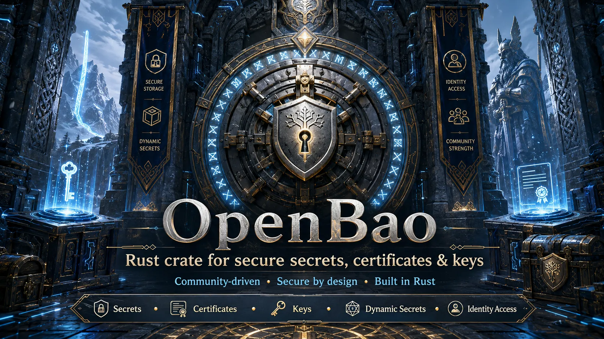

<p align="center">
  <b>Secure, typed, async Rust SDK for OpenBao.</b><br>
  Memory-safe by default. Minimal dependency surface. Built for audited secret workflows.
</p>

<div align="center">
  <a href="https://openbao.org/">OpenBao</a>
  ·
  <a href="docs/OPENBAO_API_COVERAGE.md">API Coverage</a>
  ·
  <a href="docs/RELEASE_PLAN.md">Release Plan</a>
  ·
  <a href="SECURITY.md">Security</a>
</div>

<br>

<p align="center">
  
</p>

# OpenBao Rust SDK

`openbao` is a secure, typed, async Rust SDK for
[OpenBao](https://openbao.org/), the community-driven open source fork of
Vault. It is designed for audited secret workflows: HTTPS by default, no
redirect forwarding, strict path validation, secret-aware token types, and a
small reviewed dependency surface.

The crate name on crates.io is `openbao`; Rust imports are lowercase:

```rust
use openbao::Client;
```

This README documents the `0.4.0` development line. `0.4.0` builds on the
published `0.3.0` crate with environment-based client construction,
Kubernetes auth, TLS certificate auth, PKI, and service-startup ergonomics
planned for this release.

The crate is dual-licensed under MIT or Apache-2.0.

## Current Status

Implemented now:

- Async client with typestate authentication.
- Direct token authentication with `secrecy::SecretString`.
- AppRole login with secret-aware role ID, secret ID, token, and accessor
  handling.
- Kubernetes auth login plus config and role administration helpers.
- TLS certificate auth login, method config, CA role, and CRL administration
  helpers.
- Token create, lookup, accessor lookup/list, renew, revoke, and revoke-self
  helpers.
- KV v2 read, write, CAS write, patch, list, latest delete, version read,
  version delete, undelete, destroy, metadata, backend config, typed data, and
  secret-aware service config helpers.
- KV v1 read, write, delete, and list helpers.
- PKI URL config, role write/read/list/delete, issue, sign, revoke,
  certificate list, and certificate read helpers.
- Transit key create, read, list, delete, encrypt, decrypt, rewrap, data key,
  random, hash, HMAC, sign, and verify helpers.
- System health, seal status, and loopback-only dev bootstrap helpers.
- Secret and auth mount enable, list, read, tune, and disable helpers.
- Response wrapping lookup, wrap, unwrap, and rewrap helpers.
- ACL policy list, read, write, delete, and prefix list helpers.
- Capability checks for the caller token, an explicit token, or a token
  accessor.
- Audit device list, enable, disable, and hash helpers.
- Safe exact lease lookup, renew, and revoke helpers.
- Plugin catalog list, type-list, register, read, delete, and backend reload
  helpers.
- Environment-based client construction from common OpenBao/Vault variables.
- Raw JSON request escape hatch for endpoints that are not typed yet.
- Local TLS OpenBao Podman stack on `9940` and `9941`.
- Real OpenBao integration test gate using the pinned OpenBao image.

Planned next:

- `0.4.0`: remaining PKI authority management.
- `0.5.0`: database secrets, JWT/OIDC, and userpass.
- `0.6.0`: SSH, TOTP, and explicitly gated production init/unseal/rekey/rotate APIs.
- `0.7.0`: cubbyhole, identity, Kubernetes secrets, LDAP secrets, and
  RabbitMQ.
- `0.8.0`: remaining auth methods and broader system backend automation.

See [API Coverage](docs/OPENBAO_API_COVERAGE.md) and
[Release Plan](docs/RELEASE_PLAN.md) for the road to `1.0.0`.

## Trust Dashboard

| Area | Status |
| --- | --- |
| License | `MIT OR Apache-2.0` |
| Rust edition | 2024 |
| MSRV | Rust `1.95` |
| Async runtime | Runtime-agnostic client; examples use Tokio |
| HTTP transport | `reqwest` with redirects disabled |
| Default TLS backend | Rustls |
| TLS floor | TLS 1.3 by default; TLS 1.2 requires explicit opt-in |
| Plain HTTP | Rejected by default; numeric loopback IPs only when explicitly enabled |
| Token storage | `secrecy::SecretString` |
| Unsafe policy | `unsafe_code = "forbid"` |
| Path validation | Rejects traversal, query/fragment injection, empty segments, controls, and trailing periods |
| Error posture | API error strings are bounded and sanitized before formatting |
| Dependency policy | `cargo deny` plus RustSec audit in the release gate |
| Release evidence | fmt, clippy, tests, docs, deny, audit, SBOM, and real OpenBao integration |
| Pentest gate | Required before tagging a release |

Security details live in [SECURITY.md](SECURITY.md). Release evidence and
release sequencing live in [release-notes](release-notes) and
[docs/RELEASE_PLAN.md](docs/RELEASE_PLAN.md).

## Install

```toml
[dependencies]
openbao = "0.4"
secrecy = "0.10.3"
serde = { version = "1.0.228", features = ["derive"] }
tokio = { version = "1.52.3", features = ["macros", "rt-multi-thread"] }
```

Some advanced examples below name transport and JSON helper types directly:

```toml
[dependencies]
reqwest = { version = "0.13.4", default-features = false, features = ["rustls"] }
serde_json = "1.0.150"
```

The crate defaults to the common SDK surface:

```toml
[dependencies]
openbao = { version = "0.4", features = ["approle", "cert-auth", "kubernetes-auth", "token", "kv1", "kv2", "pki", "transit", "sys", "rustls-tls"] }
```

For a smaller build, disable defaults and opt into only what the application
uses:

```toml
[dependencies]
openbao = { version = "0.4", default-features = false, features = ["kv2", "sys", "rustls-tls"] }
```

## Features

| Feature | Default | Purpose |
| --- | --- | --- |
| `approle` | yes | AppRole authentication helpers. |
| `cert-auth` | yes | TLS certificate auth login/config/role/CRL helpers. |
| `kubernetes-auth` | yes | Kubernetes auth login/config/role helpers. |
| `token` | yes | Token lifecycle helpers. |
| `kv1` | yes | KV v1 secrets engine helpers. |
| `kv2` | yes | KV v2 secrets engine helpers. |
| `pki` | yes | PKI role, issue/sign, revoke, cert read/list, and URL config helpers. |
| `transit` | yes | Transit cryptography helpers. |
| `sys` | yes | System backend helpers. |
| `rustls-tls` | yes | Rustls transport configuration. |
| `native-tls` | no | Legacy native TLS support. Requires `native-tls-acknowledged` after audit. |
| `native-tls-acknowledged` | no | Explicit acknowledgment for audited native TLS builds. |

## Support Matrix

### Client, Transport, And TLS

| Capability | Status | Notes |
| --- | --- | --- |
| Async client | Yes | Built on `reqwest` with a small public API surface. |
| Typestate auth | Yes | Separate unauthenticated and authenticated client states. |
| HTTPS by default | Yes | Plain HTTP is rejected unless loopback HTTP is explicitly enabled. |
| Redirect protection | Yes | Redirect following is disabled to avoid forwarding token headers. |
| TLS floor | Yes | TLS 1.3 minimum by default; audited legacy deployments can opt down to TLS 1.2. |
| Custom CA roots | Yes | Extra root certificates can be merged with the platform trust store. |
| Root-only trust stores | Yes | System roots can be bypassed by using only configured root certificates. |
| Client TLS identity | Yes | Optional mutual TLS client identity for TLS certificate auth. |
| Connection timeout | Yes | 5-second connection timeout by default; caller overrides are bounded. |
| User agent fingerprinting | Yes | Default user agent omits the exact crate version. |
| Namespace header | Yes | `X-Vault-Namespace` support for namespace-aware deployments. |
| Environment construction | Yes | Reads `OPENBAO_*`, `BAO_*`, and `VAULT_*` aliases with secure defaults. |
| Raw JSON requests | Yes | Escape hatch for endpoints that are not typed yet. |

### Authentication

| Capability | Status | Notes |
| --- | --- | --- |
| Direct token auth | Yes | Tokens are accepted as `SecretString`. |
| `X-Vault-Token` | Yes | Default documented OpenBao-compatible token header. |
| Bearer auth | Yes | Optional `Authorization: Bearer` header mode. |
| AppRole login | Yes | Role ID and secret ID are secret-aware; returned token is wrapped. |
| Token accessor handling | Yes | Accessors are treated as secret material. |
| Token lifecycle helpers | Yes | Lookup, accessor lookup/list, renew, revoke, revoke-self, and create helpers. |
| Kubernetes auth | Yes | Login, auth method config, and role administration helpers. |
| TLS certificate auth | Yes | Login, auth method config, CA role administration, and CRL helpers. |
| JWT/OIDC and userpass | Planned | Planned for `0.5.0`. |

### Secret Engines

| Capability | Status | Notes |
| --- | --- | --- |
| KV v2 read/write | Yes | Typed serialization and deserialization. |
| KV v2 CAS write | Yes | Optional check-and-set version support. |
| KV v2 patch | Yes | JSON merge patch content type. |
| KV v2 list/delete versions | Yes | Metadata list, latest delete, soft delete, undelete, and destroy. |
| KV v2 metadata/config | Yes | Backend, per-key metadata, typed data, and secret-aware service config helpers. |
| KV v1 | Yes | Read, write, delete, and list helpers. |
| Transit | Yes | Key create/read/list/delete, encrypt, decrypt, rewrap, data key, random, hash, HMAC, sign, and verify. |
| PKI | Partial | URL config, roles, issue, sign, revoke, certificate list, and certificate read are implemented. |
| Database credentials | Planned | Planned for `0.5.0`. |
| SSH and TOTP | Planned | Planned for `0.6.0`. |
| Identity and remaining engines | Planned | Planned for `0.7.0`. |

### System Backend And Operations

| Capability | Status | Notes |
| --- | --- | --- |
| Health | Yes | Accepts OpenBao active, standby, sealed, and uninitialized health statuses. |
| Init status | Yes | Typed `/sys/init` status helper. |
| Seal status | Yes | Typed `/sys/seal-status` helper. |
| Dev bootstrap | Yes | Fresh numeric-loopback dev instances only; not for production or HSM/KMS deployments. |
| Mount management | Yes | Secret and auth mount enable/list/read/tune/disable helpers. |
| Response wrapping | Yes | Lookup, wrap, unwrap, and rewrap helpers. |
| Policies and capabilities | Yes | ACL policy helpers plus self/token/accessor capability checks. |
| Audit devices | Yes | Enable, list, disable, and audit hash helpers. |
| Lease helpers | Yes | Safe exact lookup, renew, and revoke; prefix/force/tidy operations are intentionally not exposed. |
| Plugin catalog | Yes | List, type-list, register, read, delete, and mounted backend reload helpers. |
| Production init, unseal, rekey, rotate | Planned | Explicit safety documentation in `0.6.0`. |
| Quotas, metrics, namespaces | Planned | Planned in the `0.8.0` operations line. |

## Examples

Create a client from an existing token:

```rust,no_run
use openbao::{Client, Result};
use secrecy::SecretString;

#[tokio::main]
async fn main() -> Result<()> {
    let token = SecretString::from(std::env::var("BAO_TOKEN").unwrap_or_default());
    let client = Client::new("https://bao.example.com:8200")?.with_token(token);

    let health = client.sys().health().await?;
    println!("openbao version: {}", health.version);
    Ok(())
}
```

Create an authenticated client from environment variables:

```rust,no_run
use openbao::{Client, Result};

#[tokio::main]
async fn main() -> Result<()> {
    // Reads OPENBAO_ADDR/BAO_ADDR/VAULT_ADDR plus token, namespace, and CA aliases.
    let client = Client::from_env_with_token()?;

    let health = client.sys().health().await?;
    println!("openbao version: {}", health.version);
    Ok(())
}
```

Configure a stricter client with a namespace and root-only trust store:

```rust,no_run
use openbao::{Client, OpenBaoConfig, Result};
use reqwest::Certificate;
use secrecy::SecretString;

#[tokio::main]
async fn main() -> Result<()> {
    let ca_pem = std::fs::read("openbao-ca.pem")
        .map_err(|error| openbao::Error::InvalidTlsConfig(error.to_string()))?;
    let ca = Certificate::from_pem(&ca_pem)?;

    let config = OpenBaoConfig::new("https://bao.example.com:8200")?
        .namespace("admin/team-a")?
        .only_root_certificates(vec![ca])?;

    let token = SecretString::from(std::env::var("BAO_TOKEN").unwrap_or_default());
    let client = Client::from_config(config)?.with_token(token);

    let seal = client.sys().seal_status().await?;
    println!("sealed: {}", seal.sealed);
    Ok(())
}
```

Authenticate with AppRole:

```rust,no_run
use openbao::{Client, Result};
use secrecy::SecretString;

#[tokio::main]
async fn main() -> Result<()> {
    let client = Client::new("https://bao.example.com:8200")?;
    let role_id = SecretString::from(std::env::var("APPROLE_ROLE_ID").unwrap_or_default());
    let secret_id = SecretString::from(std::env::var("APPROLE_SECRET_ID").unwrap_or_default());

    let (client, login) = client.login_approle(role_id, secret_id).await?;
    let health = client.sys().health().await?;

    let _token_accessor = login.accessor;
    println!("openbao version: {}", health.version);
    Ok(())
}
```

Write and read KV v2 data:

```rust,no_run
use openbao::{Client, Result};
use secrecy::SecretString;
use serde::{Deserialize, Serialize};

#[derive(Deserialize, Serialize)]
struct DatabaseCredentials {
    username: String,
    password: SecretString,
}

#[tokio::main]
async fn main() -> Result<()> {
    let token = SecretString::from(std::env::var("BAO_TOKEN").unwrap_or_default());
    let client = Client::new("https://bao.example.com:8200")?.with_token(token);
    let kv = client.kv2("secret")?;

    kv.write(
        "production/database",
        DatabaseCredentials {
            username: "app".to_owned(),
            password: SecretString::from("change-me"),
        },
    )
    .await?;

    let secret = kv
        .read::<DatabaseCredentials>("production/database")
        .await?;

    println!("username: {}", secret.data.username);
    let _password_is_not_logged = secret.data.password;
    Ok(())
}
```

Use KV v2 check-and-set, patch, and version operations:

```rust,no_run
use openbao::secrets::kv2::{Kv2MetadataOptions, Kv2WriteOptions};
use openbao::{Client, Result};
use secrecy::SecretString;
use serde::Serialize;

#[derive(Serialize)]
struct Patch {
    password: SecretString,
}

#[tokio::main]
async fn main() -> Result<()> {
    let token = SecretString::from(std::env::var("BAO_TOKEN").unwrap_or_default());
    let client = Client::new("https://bao.example.com:8200")?.with_token(token);
    let kv = client.kv2("secret")?;

    kv.write_with_options(
        "app/config",
        serde_json::json!({ "username": "app", "password": "first" }),
        Some(Kv2WriteOptions { cas: Some(0) }),
    )
    .await?;

    let second = kv
        .patch("app/config", Patch {
            password: SecretString::from("rotated"),
        })
        .await?;

    let _previous = kv
        .read_version::<serde_json::Value>("app/config", second.version - 1)
        .await?;
    kv.delete_versions("app/config", &[second.version - 1]).await?;
    kv.undelete_versions("app/config", &[second.version - 1]).await?;
    kv.destroy_versions("app/config", &[second.version - 1]).await?;

    kv.patch_metadata(
        "app/config",
        &Kv2MetadataOptions {
            max_versions: Some(10),
            cas_required: Some(true),
            delete_version_after: Some("24h".to_owned()),
            custom_metadata: None,
        },
    )
    .await?;

    Ok(())
}
```

Load service configuration from KV v2:

```rust,no_run
use openbao::{Client, Result};
use secrecy::SecretString;
use serde::Deserialize;

#[derive(Deserialize)]
struct AppConfig {
    database_url: SecretString,
    listen_addr: String,
}

#[tokio::main]
async fn main() -> Result<()> {
    let token = SecretString::from(std::env::var("BAO_TOKEN").unwrap_or_default());
    let client = Client::new("https://bao.example.com:8200")?.with_token(token);
    let kv = client.kv2("secret")?;

    let typed = kv.read_data::<AppConfig>("services/api").await?;
    let env_map = kv.read_service_config("services/api-env").await?;

    println!("listen: {}", typed.listen_addr);
    println!("loaded {} secret config keys", env_map.len());
    let _database_url_is_not_logged = typed.database_url;
    Ok(())
}
```

Use a KV v1 mount:

```rust,no_run
use openbao::{Client, Result};
use secrecy::SecretString;
use serde::{Deserialize, Serialize};

#[derive(Deserialize, Serialize)]
struct Config {
    endpoint: String,
}

#[tokio::main]
async fn main() -> Result<()> {
    let token = SecretString::from(std::env::var("BAO_TOKEN").unwrap_or_default());
    let client = Client::new("https://bao.example.com:8200")?.with_token(token);
    let kv = client.kv1("legacy-secret")?;

    kv.write("app/config", Config {
        endpoint: "https://api.example.com".to_owned(),
    })
    .await?;

    let config = kv.read::<Config>("app/config").await?;
    let keys = kv.list("app").await?;

    println!("endpoint: {}", config.endpoint);
    println!("keys: {}", keys.keys.len());
    Ok(())
}
```

Encrypt and decrypt through Transit:

```rust,no_run
use openbao::secrets::transit::{TransitDecryptRequest, TransitEncryptRequest};
use openbao::{Client, Result};
use secrecy::{ExposeSecret, SecretString};

#[tokio::main]
async fn main() -> Result<()> {
    let token = SecretString::from(std::env::var("BAO_TOKEN").unwrap_or_default());
    let client = Client::new("https://bao.example.com:8200")?.with_token(token);
    let transit = client.transit("transit")?;

    let encrypted = transit
        .encrypt(
            "app-key",
            &TransitEncryptRequest {
                plaintext: SecretString::from("c2VjcmV0"),
                associated_data: None,
                context: None,
                key_version: None,
                nonce: None,
            },
        )
        .await?;

    let decrypted = transit
        .decrypt(
            "app-key",
            &TransitDecryptRequest {
                ciphertext: encrypted.ciphertext,
                associated_data: None,
                context: None,
                nonce: None,
            },
        )
        .await?;

    println!("plaintext length: {}", decrypted.plaintext.expose_secret().len());
    Ok(())
}
```

Create, inspect, renew, and revoke a child token:

```rust,no_run
use openbao::auth::token::TokenCreateRequest;
use openbao::{Client, Result};
use secrecy::SecretString;
use std::collections::BTreeMap;

#[tokio::main]
async fn main() -> Result<()> {
    let root_or_parent = SecretString::from(std::env::var("BAO_TOKEN").unwrap_or_default());
    let client = Client::new("https://bao.example.com:8200")?.with_token(root_or_parent);

    let child = client
        .token()
        .create(&TokenCreateRequest {
            policies: vec!["default".to_owned()],
            meta: BTreeMap::from([("owner".to_owned(), "example".to_owned())]),
            display_name: Some("example-child".to_owned()),
            ttl: Some("30m".to_owned()),
            explicit_max_ttl: Some("1h".to_owned()),
            renewable: Some(true),
            ..TokenCreateRequest::default()
        })
        .await?;

    let info = client.token().lookup(&child.client_token).await?;
    println!("renewable: {}", info.renewable);

    let _renewed = client.token().renew(&child.client_token, Some("15m")).await?;
    client.token().revoke_accessor(&child.accessor).await?;
    Ok(())
}
```

Enable and tune a KV v2 mount:

```rust,no_run
use openbao::sys::{LeaseDuration, MountConfig, MountEnableRequest};
use openbao::{Client, Result};
use secrecy::SecretString;
use std::collections::BTreeMap;

#[tokio::main]
async fn main() -> Result<()> {
    let token = SecretString::from(std::env::var("BAO_TOKEN").unwrap_or_default());
    let client = Client::new("https://bao.example.com:8200")?.with_token(token);

    client
        .sys()
        .enable_mount(
            "apps",
            &MountEnableRequest {
                backend_type: "kv".to_owned(),
                description: Some("application secrets".to_owned()),
                config: Some(MountConfig {
                    default_lease_ttl: Some(LeaseDuration::Duration("30m".to_owned())),
                    max_lease_ttl: Some(LeaseDuration::Duration("2h".to_owned())),
                    ..MountConfig::default()
                }),
                options: BTreeMap::from([("version".to_owned(), "2".to_owned())]),
                local: None,
                seal_wrap: Some(true),
                external_entropy_access: None,
            },
        )
        .await?;

    let mounts = client.sys().list_mounts().await?;
    println!("mount count: {}", mounts.len());
    Ok(())
}
```

Wrap and unwrap JSON data:

```rust,no_run
use openbao::{Client, Result};
use secrecy::SecretString;
use serde::{Deserialize, Serialize};

#[derive(Deserialize, Serialize)]
struct WrappedPayload {
    nonce: String,
}

#[tokio::main]
async fn main() -> Result<()> {
    let token = SecretString::from(std::env::var("BAO_TOKEN").unwrap_or_default());
    let client = Client::new("https://bao.example.com:8200")?.with_token(token);

    let wrap = client
        .sys()
        .wrapping_wrap("5m", &WrappedPayload {
            nonce: "one-time".to_owned(),
        })
        .await?;

    let payload = client
        .sys()
        .wrapping_unwrap::<WrappedPayload>(Some(&wrap.token))
        .await?;

    println!("payload nonce length: {}", payload.nonce.len());
    Ok(())
}
```

Write an ACL policy and check capabilities:

```rust,no_run
use openbao::sys::PolicyWriteRequest;
use openbao::{Client, Result};
use secrecy::SecretString;

#[tokio::main]
async fn main() -> Result<()> {
    let token = SecretString::from(std::env::var("BAO_TOKEN").unwrap_or_default());
    let client = Client::new("https://bao.example.com:8200")?.with_token(token);

    client
        .sys()
        .write_policy(
            "app-read",
            &PolicyWriteRequest {
                policy: r#"path "secret/data/app" { capabilities = ["read"] }"#.to_owned(),
                expiration: None,
                ttl: None,
                cas: None,
                cas_required: None,
            },
        )
        .await?;

    let capabilities = client.sys().capabilities_self(["secret/data/app"]).await?;
    let _for_path = capabilities.by_path.get("secret/data/app");
    Ok(())
}
```

Enable an audit device and calculate an audit hash:

```rust,no_run
use openbao::sys::AuditEnableRequest;
use openbao::{Client, Result};
use secrecy::SecretString;
use std::collections::BTreeMap;

#[tokio::main]
async fn main() -> Result<()> {
    let token = SecretString::from(std::env::var("BAO_TOKEN").unwrap_or_default());
    let client = Client::new("https://bao.example.com:8200")?.with_token(token);

    client
        .sys()
        .enable_audit_device(
            "file",
            &AuditEnableRequest {
                backend_type: "file".to_owned(),
                description: Some("local audit file".to_owned()),
                options: BTreeMap::from([(
                    "file_path".to_owned(),
                    "/var/log/openbao/audit.log".to_owned(),
                )]),
                local: None,
            },
        )
        .await?;

    let hash = client
        .sys()
        .audit_hash("file", &SecretString::from("known-secret-value"))
        .await?;

    println!("audit hash prefix: {}", hash.hash.split(':').next().unwrap_or(""));
    Ok(())
}
```

Look up and renew one exact lease:

```rust,no_run
use openbao::{Client, Result};
use secrecy::SecretString;

#[tokio::main]
async fn main() -> Result<()> {
    let token = SecretString::from(std::env::var("BAO_TOKEN").unwrap_or_default());
    let lease_id = SecretString::from(std::env::var("BAO_LEASE_ID").unwrap_or_default());
    let client = Client::new("https://bao.example.com:8200")?.with_token(token);

    let lease = client.sys().lookup_lease(&lease_id).await?;
    if lease.renewable {
        let renewed = client.sys().renew_lease(&lease_id, Some(1800)).await?;
        println!("renewed lease seconds: {}", renewed.lease_duration);
    }

    Ok(())
}
```

Read and reload a plugin catalog entry:

```rust,no_run
use openbao::sys::{PluginReloadRequest, PluginType};
use openbao::{Client, Result};
use secrecy::SecretString;

#[tokio::main]
async fn main() -> Result<()> {
    let token = SecretString::from(std::env::var("BAO_TOKEN").unwrap_or_default());
    let client = Client::new("https://bao.example.com:8200")?.with_token(token);

    let plugins = client.sys().list_plugins_by_type(PluginType::Secret).await?;
    if plugins.keys.iter().any(|name| name == "transit") {
        let _info = client
            .sys()
            .read_plugin(PluginType::Secret, "transit", None)
            .await?;
    }

    client
        .sys()
        .reload_plugin_backend(&PluginReloadRequest {
            plugin: Some("example-plugin".to_owned()),
            mounts: Vec::new(),
            scope: None,
        })
        .await?;

    Ok(())
}
```

Call an endpoint that is not typed yet:

```rust,no_run
use openbao::{Client, Result};
use reqwest::Method;
use secrecy::SecretString;
use serde_json::Value;

#[tokio::main]
async fn main() -> Result<()> {
    let token = SecretString::from(std::env::var("BAO_TOKEN").unwrap_or_default());
    let client = Client::new("https://bao.example.com:8200")?.with_token(token);

    let response: Value = client
        .request_json(Method::GET, "sys/internal/specs/openapi", Option::<&Value>::None)
        .await?;

    println!("openapi keys: {}", response.as_object().map_or(0, |object| object.len()));
    Ok(())
}
```

The raw request layer is intentionally low level. Prefer typed helpers when the
crate supports an endpoint; use raw JSON to bridge missing OpenBao APIs while
coverage grows.

## Local OpenBao Dev Instance

The local dev stack uses Podman, TLS, a private CA, and loopback-only ports in
the requested `994x` range.

Prepare the rootless Podman volume and TLS assets without starting OpenBao:

```bash
scripts/openbao_dev.sh prepare
```

This project does not require a `/srv` directory tree for local development:
raft data lives in a Podman-managed volume, and TLS material lives in the
ignored `deploy/podman/dev-state/` directory.

```bash
scripts/openbao_dev.sh up
```

Endpoints:

- API: `https://127.0.0.1:9940`
- Cluster: `https://127.0.0.1:9941`
- CA certificate: `deploy/podman/dev-state/tls/dev-ca.crt`

Initialize and unseal OpenBao using `bao operator init` and
`bao operator unseal`, then export `BAO_ADDR=https://127.0.0.1:9940` and
`BAO_CACERT=deploy/podman/dev-state/tls/dev-ca.crt`.

For disposable local development, the crate can initialize and unseal a fresh
numeric-loopback instance directly:

```rust,no_run
use openbao::{Client, OpenBaoConfig, Result, sys::DevBootstrapOptions};
use reqwest::Certificate;

#[tokio::main]
async fn main() -> Result<()> {
    let ca_pem = std::fs::read("deploy/podman/dev-state/tls/dev-ca.crt")
        .map_err(|error| openbao::Error::InvalidTlsConfig(error.to_string()))?;
    let ca = Certificate::from_pem(&ca_pem)?;

    let config = OpenBaoConfig::new("https://127.0.0.1:9940")?
        .only_root_certificates(vec![ca])?;
    let client = Client::from_config(config)?;

    let bootstrap = client
        .sys()
        .bootstrap_dev(&DevBootstrapOptions::single_key())
        .await?;

    let health = bootstrap.client.sys().health().await?;
    println!("initialized: {}, sealed: {}", health.initialized, health.sealed);
    Ok(())
}
```

`bootstrap_dev` is not a production initialization ceremony. It creates root
and unseal material in process memory, uses Shamir keys, refuses non-loopback
targets, and refuses already initialized servers. Do not use it with HSM/KMS
auto-unseal, shared environments, or any instance that requires operator key
ceremony.

Run the real OpenBao integration flow:

```bash
scripts/openbao_integration.sh
```

The integration script creates a fresh TLS dev instance, initializes and
unseals it, stores the root token in a temporary `0600` file for the test
process, and removes that file when the run exits.

## Release Discipline

Run the normal local checks:

```bash
scripts/checks.sh
```

Run the current release gate:

```bash
scripts/release_0_4_gate.sh
```

Set `OPENBAO_SKIP_INTEGRATION=1` only when Podman is unavailable; release
candidate validation should run the integration gate.

No release tag should be cut unless the matching pentest report status is
reviewed and recorded in the release notes.
